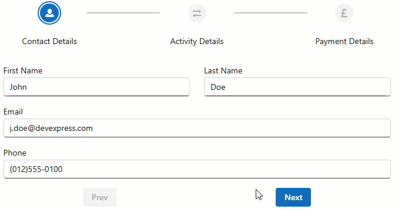

<!-- default badges list -->
[](https://supportcenter.devexpress.com/ticket/details/T1311551)
[](https://docs.devexpress.com/GeneralInformation/403183)
[](#does-this-example-address-your-development-requirementsobjectives)
<!-- default badges end -->
# DevExpress Blazor - Implement a Stepper Component

A **Stepper** is a UI component that guides users through a sequential process by breaking complex tasks into smaller, manageable steps. It is commonly used for e-commerce checkouts, account registrations, and user onboarding.

This example demonstrates how to build a custom Stepper component for Blazor applications using [DevExpress DxGridLayout](https://docs.devexpress.com/Blazor/DevExpress.Blazor.DxGridLayout). The component supports both horizontal and vertical orientation, and can fit your specific design requirements.



## Implementation Details

The implementation consists of two components: `DxStepper` and `DxStep`.

```razor
<DxStepper Orientation=Orientation.Vertical
           @bind-SelectedIndex="@SelectedIndex">
    <Steps>
        <DxStep Label="Contact Details" IconCssClass="oi oi-person">
            <!-- Step content -->
        </DxStep>
    </Steps>
</DxStepper>
```

### DxStepper

The `DxStepper` [component](CS/blazor_stepper/Components/Stepper/DxStepper.razor) is built on top of `DxGridLayout` and manages the order and layout of steps:

- **Nodes (steps)** are placed in even columns/rows.
- **Connectors** (lines between steps) are placed in odd columns/rows.
- **Labels** are positioned below (horizontal orientation) or next to (vertical orientation) nodes.

`DxStepper` supports the following properties:

- `Steps` - Specifies the collection of steps.
- `SelectedIndex` - Returns the zero-based index of the selected step.
- `SelectedIndexChanged` event - Fires when the step is selected.
- `Orientation` - Specifies whether steps are arranged vertically or horizontally.

### DxStep Component

The `DxStep` [component](CS/blazor_stepper/Components/Stepper/DxStep.razor) represents an individual step in the stepper. `DxStep` components are placed inside the `Steps` property of the `DxStepper` component.

Each step can contain:

- Custom content (the `ChildContent` property)
- An icon (the `IconCssClass` property)
- Display text (the `Text` property)
- A label (the `Label` property)

## Files to Review

- [DxStep.razor](CS/blazor_stepper/Components/Stepper/DxStep.razor)
- [DxStepper.razor](CS/blazor_stepper/Components/Stepper/DxStepper.razor)
- [DxStepper.razor.cs](CS/blazor_stepper/Components/Stepper/DxStepper.razor.cs)
- [DxStepper.razor.css](CS/blazor_stepper/Components/Stepper/DxStepper.razor.css)
- [Index.razor](CS/blazor_stepper/Components/Pages/Index.razor)
- [Recipe.razor](CS/blazor_stepper/Components/Pages/Recipe.razor)

## Documentation

- [DxGridLayout](https://docs.devexpress.com/Blazor/DevExpress.Blazor.DxGridLayout)
- [DxGridLayoutItem](https://docs.devexpress.com/Blazor/DevExpress.Blazor.DxGridLayoutItem)
- [DxGridLayoutItem.Template](https://docs.devexpress.com/Blazor/DevExpress.Blazor.DxGridLayoutItem.Template)

## More Examples

- [Form Layout for Blazor - Tabbed Wizard](https://github.com/DevExpress-Examples/blazor-formlayout-implement-tabbed-wizard)
<!-- feedback -->
## Does this example address your development requirements/objectives?

[](https://www.devexpress.com/support/examples/survey.xml?utm_source=github&utm_campaign=draft-example-blazor-stepper&~~~was_helpful=yes) [](https://www.devexpress.com/support/examples/survey.xml?utm_source=github&utm_campaign=draft-example-blazor-stepper&~~~was_helpful=no)

(you will be redirected to DevExpress.com to submit your response)
<!-- feedback end -->
